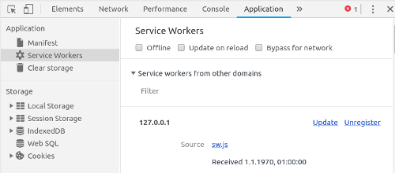

# VINI
Vehicle Identification Number Index

[Pflichtenheft](https://docs.google.com/document/d/14qUSI1B63PySAALUn278eczSE2-FgaKpBV39wjuTZ_U/edit?usp=sharing)
 
The react website gets automatically deployed: [click me](https://sgse18.github.io/VINI/) 

You may need to clear your browser cache if changes are still not visible, after TravisCI successfully built your commit.
(maybe a "feature" of the serviceworker)

#### Fix tedious cache-clearing by manually unregistering the serviceworker.

